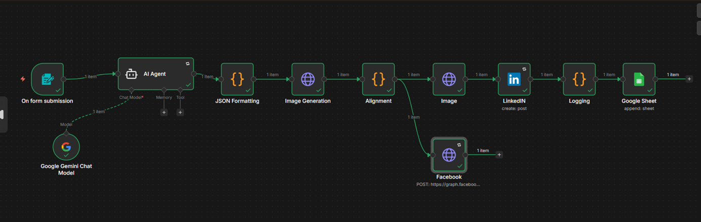

# 🚀 AI Social Media Automation using n8n

## 📌 Overview

This project is an end-to-end automation workflow built using **n8n** that generates and posts AI-driven social media content.

It takes a topic as input, generates platform-specific content using Google Gemini, creates images, posts to platforms, and logs everything in Google Sheets.

---

## 🖼️ Workflow

---

## ⚙️ Features

* 🤖 AI-generated content using Google Gemini
* 📝 Platform-specific captions (LinkedIn & Instagram style)
* 🖼️ Image generation using Pollinations AI
* 📤 Automated posting to LinkedIn and Facebook
* 📊 Google Sheets logging for tracking outputs
* 🛠️ JSON validation and error handling

---

## 🔄 Workflow Steps

1. User inputs topic via form
2. Gemini generates structured content (captions, hashtags, CTA, image prompt)
3. JSON output is validated and formatted
4. Image is generated dynamically
5. Content is posted to LinkedIn and Facebook
6. All outputs are logged in Google Sheets

---

## 🧰 Tech Stack

* n8n (workflow automation)
* Google Gemini API
* Facebook Graph API
* LinkedIn API
* Google Sheets API
* Pollinations AI

---

## 🧠 Design Approach

This system was designed using **free-tier APIs** while maintaining full functionality.
Focus was on:

* Structured AI output
* Reliability and error handling
* Clean workflow design

---

## ⚠️ Limitations

* Few Othercsocial media posting was not implemented (API restrictions)
* Free-tier API rate limits (Gemini)
* Basic retry handling

---

## 🚀 Future Improvements

* Add scheduling (cron-based automation)
* Implement retry with exponential backoff
* Upgrade image generation model

---

